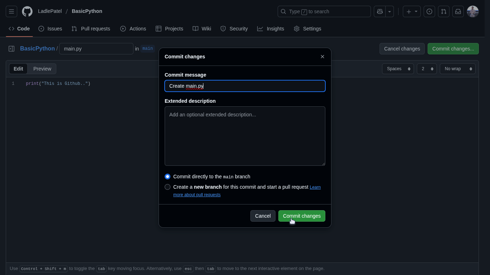

# GitHub for Absolute Beginners

## What is GitHub?
GitHub is a platform where developers store, share, and collaborate on code projects. Think of it as Google Drive, but specifically designed for code.

---

## Step 1: Create Your GitHub Account

1. Open your web browser (Chrome, Firefox, Safari, etc.)
2. Go to **https://github.com**
3. You'll see the GitHub homepage with the sign up button
4. Click the **"Sign up"** button in the top-right corner


## Step 2: Fill Out the Registration Form

1. You'll see the signup page with fields for email, password and username
2. Enter your **email address**
3. Create a **password** (make it strong!)
4. Choose a **username** (this will be your GitHub identity)
5. Click **"Create account"**
6. Complete any verification steps GitHub asks for


## Step 3: Create Your First Repository

After logging in, you'll see your GitHub dashboard.

1. Look for **"New repository"** button in the top-right
2. Click on it to start creating your first project


## Step 4: Set Up Your Repository

Fill out the repository details:

1. **Repository name**: Enter something like `BasicPython`
2. **Description**: Add a brief description like "Basic Python Repository"
3. **Visibility**: 
   - Choose **Public** if you want others to see your code
   - Choose **Private** if you want to keep it to yourself
4. **Initialize repository**:
   - ✅ Check "Add a README file"
   - ✅ Check "Add .gitignore" and select **Python** from the dropdown
5. Click the green **"Create repository"** button


## Step 5: Explore Your New Repository

Congratulations! You now have your first repository with:
- A **README.md** file (describes your project)
- A **.gitignore** file (tells Git which files to ignore)


## Step 6: Create Your First Code File

1. Click the **"Add file"** button or **"Create new file"**
2. Name your file `main.py` (type this in the filename box)
3. In the code editor, write some simple Python code:
   ```python
   print("Hello, GitHub!")
   print("This is my first Python file!")
   ```


## Step 7: Save Your Changes (Commit)

Every time you save changes in GitHub, it's called a "commit":

1. Scroll down to the **"Commit changes"** section
2. In the commit message box, write: `Create main.py`
3. Optionally, add a longer description
4. Click the green **"Commit changes"** button


After clicking commit changes, you'll see the commit interface:



## Step 8: View Your Updated Repository

You're back at your repository homepage! You should now see:
- README.md
- .gitignore
- main.py (your new file)


## Step 9: Edit an Existing File

1. Click on **main.py** to open it
2. You'll see your code displayed
3. Click the **pencil icon** (✏️) in the top-right to edit the file
4. Make changes to your code, like adding:
   ```python
   print("Hello, GitHub!")
   print("This is my first Python file!")
   print("I'm learning to use GitHub!")
   ```


## Step 10: Save Your Edits

1. Scroll down to **"Commit changes"**
2. Write a commit message like: `Update main.py with additional print statement`
3. Click **"Commit changes"**

After updating, you'll see the dashboard with your updated main.py file:


---
